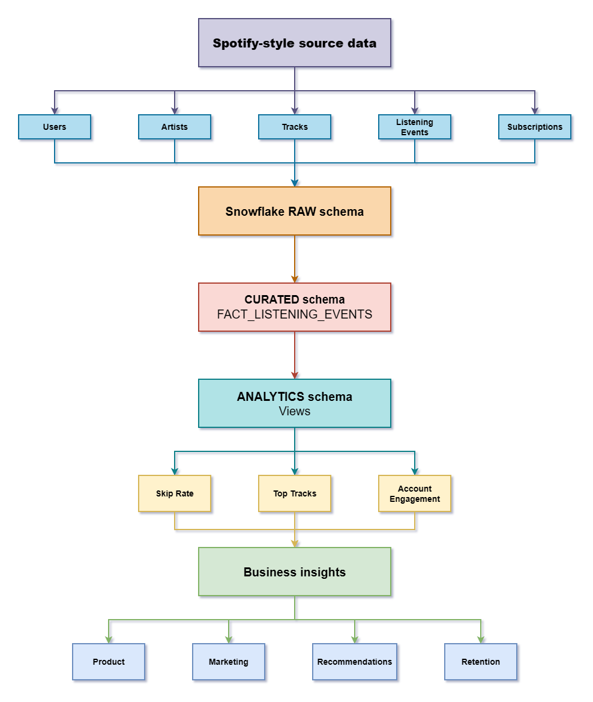
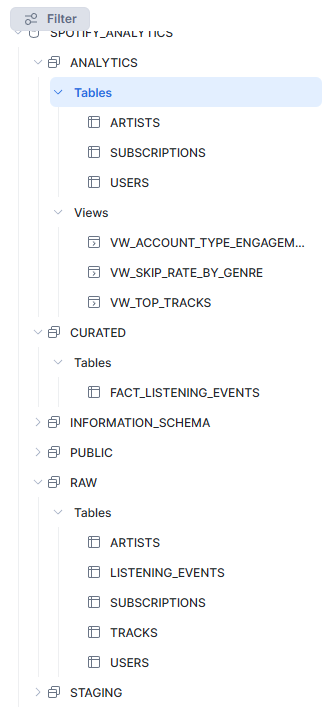
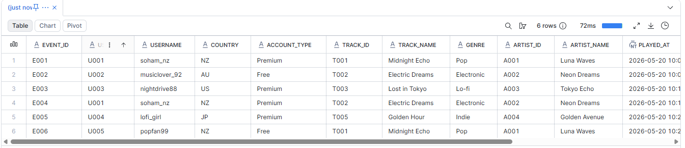
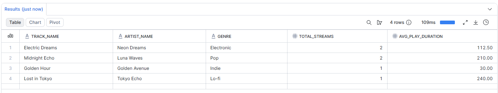
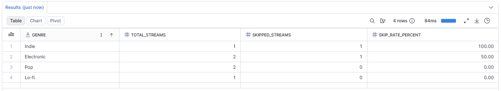
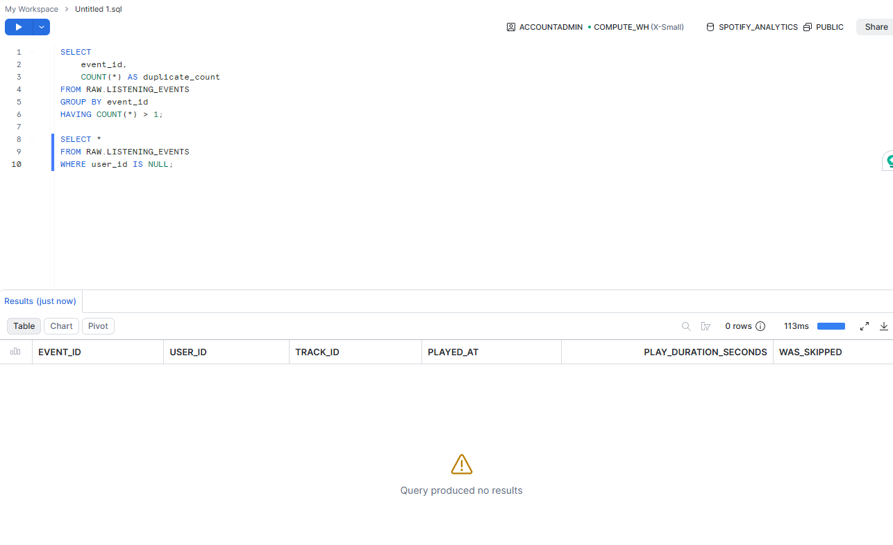

# 🎵 Spotify-Style Analytics Platform using Snowflake

## 🚀 Overview

This project demonstrates the design and implementation of a modern cloud-based analytics platform for a Spotify-style music streaming product using Snowflake.

The platform simulates ingestion, transformation, validation, and analytics processing for large-scale listening behaviour data.

The goal of this project was to strengthen and showcase practical cloud data engineering capability across modern warehousing, SQL transformation modelling, analytics engineering, and data quality validation.

---

# 🏗️ Architecture

---

# ☁️ Cloud Data Architecture

The project follows a layered warehouse approach commonly used in modern analytics engineering environments.

## RAW Layer
Stores source-system style operational data:
- Users
- Artists
- Tracks
- Listening Events
- Subscriptions

## CURATED Layer
Transforms raw operational data into analytics-ready business models.

Primary curated model:
- `FACT_LISTENING_EVENTS`

## ANALYTICS Layer
Reporting-ready views for business insights:
- Top Tracks
- Skip Rate Analysis
- Account Engagement

---

# 🧰 Tech Stack

| Technology | Purpose |
|---|---|
| Snowflake | Cloud Data Warehouse |
| SQL | Data Modelling & Analytics |
| Python | Sample Data Generation |
| GitHub | Version Control & Portfolio |
| CSV | Source Data Simulation |

---

# 📊 Analytics Use Cases

The platform supports analysis across:

- 🎧 Most streamed tracks
- ⏭️ Skip rate analysis by genre
- 👤 Premium vs free user engagement
- 🌍 Regional listening behaviour
- 📈 Product engagement insights

---

# 🧪 Data Quality Validation

The project includes validation checks for:
- Duplicate listening events
- Missing users
- Missing tracks
- Invalid play durations
- Orphaned records

---

# 📸 Snowflake Implementation Screenshots

## Database Architecture

## Raw Data Tables

## Curated Fact Table

## Analytics Views

### Top Tracks

### Skip Rate Analysis

## Data Quality Validation

---

# 💡 Business Value

This project demonstrates how modern cloud data platforms can transform raw operational events into trusted analytics datasets that support:
- Product teams
- Marketing teams
- Recommendation systems
- Customer retention strategies

---

# 🎯 Purpose

This project forms part of my transition into modern cloud and data engineering environments, building on existing experience across:
- SQL Server
- ETL pipelines
- APIs & integrations
- Middleware orchestration
- Enterprise operational systems

The focus was not just writing SQL queries, but demonstrating end-to-end cloud analytics architecture thinking.

---
